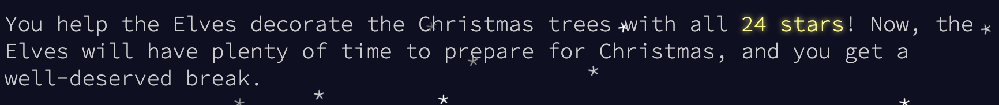

include::common/header.adoc[]

== Advent of Code 2025: An Engineer’s Solution Notebook
 [.greyed]#15 Dec 2025#

=== Solution Codebase
Find all the solutions on link:https://github.com/anton-kolhun/advent-of-code/tree/main/src/main/java/com/aoc/y2025[GitHub].

=== link:https://adventofcode.com/2025/day/1[Day 1, role=red-link]
===== Part 1
For each rotation instruction, move the dial one click at a time in the indicated direction (`L = -1, R = +1`),
wrapping around `0-99` (`100 -> 0, -1 -> 99`). After completing all clicks for an instruction, if the final position is `0`,
increment the counter.

===== Part 2
Using the same per-click simulation, increment the counter every time any click lands on position `0`,
including intermediate clicks.

=== link:https://adventofcode.com/2025/day/2[Day 2, role=red-link]
Because the input ranges can be extremely large, iterating over every value in each range is not feasible.
Instead, focus on constructing only those values that could be invalid,
and then check whether they fall within the given ranges.

===== Part 1
An invalid value consists of a sequence of digits repeated exactly twice.
For example, for the range `88–7654`, the possible repeating parts are determined from lengths between `range.start.length / 2` and `range.end.length / 2`. This gives candidates like:
```
1, 2, …, 9
10, 11, …, 99
```

Each candidate is duplicated to form a number:
```
1 → 11, 2 → 22, 10 → 1010, 21 → 2121, …
```

Only those numbers that fall within the range are counted as invalid.
For this example: `88, 99, 1010, 2121` are matching invalid IDs, while `22, 8282` are outside the range and ignored.

===== Part 2
Now, a number is invalid if a sequence of digits is repeated two or more times.
Using the same repeating parts, we generate values by repeating them multiple times until exceeding the range:

1 → 11, 111, 1111, …
12 → 1212, 121212, 12121212, …

Each candidate is checked against the range to select matching invalid IDs.

=== link:https://adventofcode.com/2025/day/3[Day 3, role=red-link]
===== Part 1
Brute-force all pairs of digits in each bank to find the maximum two-digit number.

===== Part 2
Use a greedy approach to select digits one by one for the twelve-digit number, always picking the largest digit that allows enough remaining digits to complete the selection.
Example:
```
3 1 4 1 5 9
```
In order to pick 3 digits to form the largest number - proceed as: +
First digit: consider `3 1 4 1` → pick `4` +
Second digit: consider `1 5` → pick `5` +
Third digit: last remaining digit → pick `9` +
Resulting number: `4 5 9`


=== link:https://adventofcode.com/2025/day/4[Day 4, role=red-link]
===== Part 1
For each roll, count how many of its neighbors are also rolls.
If the count is less than 4, mark the roll as accessible.
Return the total count of accessible rolls.

===== Part 2
Repeat the accessibility check iteratively:
Identify all accessible rolls (fewer than 4 neighbors) and remove them.
Continue until no rolls can be removed.
Return the total number of removed rolls.

=== link:https://adventofcode.com/2025/day/5[Day 5, role=red-link]
===== Part 1
Parse ranges and available IDs. Count each available ID that falls in at least one range.

===== Part 2
Ranges should first be sorted by start value. Then merge them to combine overlapping ranges: this ensures that no ID is double-counted.
Example:
```
Given sorted ranges as :
[1, 3], [2, 4], [10, 12], [11, 15]

Then the merge approach look as:
- Merge [1, 3] with [2, 4] → [1, 4]
- Merge [10, 12] with [11, 15] → [10, 15]

Result:
[1, 4], [10, 15]
```
The total number is calculated by summing the sizes of all merged ranges.

=== link:https://adventofcode.com/2025/day/6[Day 6, role=red-link]
===== Part 1
Parse numbers in columns and operators at the bottom. Apply each operator to its column numbers and sum all results.

===== Part 2
Iterate through the lines horizontally to capture each “column” of digits, preserving spacing for alignment.

Example:
```
  1  2
123  45
67   89
*    +
```

To read a particular column properly for every row, find the farthest index before a space (`' '`) occurs in each row.
```
- row 1 stops at index 1
- row 2 stops at index 3
- row 3 stops at index 2
```

This shows that the first column covers indices `[0,2]` in the rows.
After aligning all columns, the first column looks like: `[XX1, 123, 67X]` (where `X` represents empty/no digit).
Repeat this process for the remaining columns. Each column now represents one digit of a number, stacked top-to-bottom.
Concatenate the digits in each column to reconstruct the full numbers for the problem. Apply the math operator as in Part 1.

=== link:https://adventofcode.com/2025/day/7[Day 7, role=red-link]
===== Part 1
Simulate beam propagation from `S` through the grid.
Beams move downward; hitting a splitter (`^`) stops the beam and spawns two new beams (left and right).
Count each splitter activation until all beams exit.

===== Part 2
Use recursion with memoization to count all possible timelines.
Starting from `S`, the function recursively explores each possible path.
At each splitter (`^`), it calculates the number of timelines for the left and right paths separately and sums them.
For empty spaces, the beam continues downward with the current timeline.
Results for each coordinate are cached to avoid redundant calculations and improve performance.
The total returned by the recursive function is the number of distinct timelines.

=== link:https://adventofcode.com/2025/day/8[Day 8, role=red-link]
===== Part 1
For each of the first 1000 steps, scan all unprocessed pairs of junction boxes to find the minimum distance pair.
If the two boxes belong to different circuits, their circuits are merged into one.
Connections between boxes already in the same circuit are ignored.
After 1000 connections, all resulting circuits are collected, sorted by size,
and the sizes of the three largest circuits are multiplied to produce the final result.

===== Part 2
Apply the same nearest-pair merging strategy, but continue selecting and merging the closest unvisited pairs
until all junction boxes belong to a single circuit. Use a loop that continues while:
```
visitedCoords.size() < allCoordinates.size() OR numberOfMergedCircuits > 1
```
The last selected pair at termination is the pair whose connection completes the full merge.

=== link:https://adventofcode.com/2025/day/9[Day 9, role=red-link]
===== Part 1
All red tile coordinates are read into a list. The solution checks every pair of red tiles and treats them as opposite corners of a rectangle.
For each pair, it computes the rectangle’s area using row and column differences and tracks the maximum area found.

===== Part 2
The full red–green loop is reconstructed. Adjacent red tiles are connected with straight horizontal or vertical lines of green tiles, including a wraparound connection from the last to the first red tile. All boundary tiles are then collected to define a closed area.
The solution groups all red and green tiles by row and sorts them by column, facilitating row-wise scanning.
For each pair of red tiles, it verifies that the rectangle between them lies entirely within the allowed red/green area. This is done by scanning each row and applying a row-wise variant of the link:https://en.wikipedia.org/wiki/Point_in_polygon[Ray Casting algorithm], counting boundary crossings to determine inside/outside status.

Sample:
```
..######....
..#....#....
..#.X..#.0..
..######....
```

- `X` – inside, as the scan crosses the boundary once (odd).
- `0` – outside, as the scan crosses the boundary twice (even).

After checking all candidate rectangles, only those fully contained within the allowed area are considered. The rectangle with the largest area among these is selected as the solution.

=== link:https://adventofcode.com/2025/day/10[Day 10, role=red-link]
===== Part 1
Use a depth-first search to explore sequences of button presses. Track visited states to avoid repeating work.
Apply memoization (cache) to store minimum presses needed from each state.

===== Part 2
Each machine’s counters must reach exact target values, each button increments specific counters by 1 per press.
Since brute-force approach would be infeasible due to the large search space, model the problem as integer linear optimization problem:

Variables:

- For each button `i`, define an integer variable `button[i]` representing how many times it is pressed.

Constraints:

- `button[i] ≥ 0 for all i`.
- For each counter `i`, sum over buttons affecting `i` equals `target[i]`.

Example:
```
(3) (1,3) (2) (2,3) (0,2) (0,1) {3,5,4,7}
```

Translates into the following equations:
```
button0 >= 0, button1 >= 0, button2 >= 0, button3 >= 0,  button4 >= 0,  button5 >= 0
button4 + button5 = 3
button1 + button5 = 5
button2 + button3 + button4 = 4
button0 + button1 + button3 = 7
```

Finally use link:https://en.wikipedia.org/wiki/Z3_Theorem_Prover[Z3’s] Optimize API to find the minimal total presses satisfying all counter constraints.

=== link:https://adventofcode.com/2025/day/11[Day 11, role=red-link]
===== Part 1
Use DFS with memoization to explore all paths in the directed graph. Increment the count whenever the `out` node is reached.

===== Part 2
Since enumerating all paths from `svr` to `out` is infeasible due to the extremely large number of possibilities,
the key observation is that there is no path from `dac` to `fft`.
Using this, we can split the path into three segments: `svr → fft, fft → dac, and dac → out`.
Count the paths in each segment using the Part 1 approach (DFS with memoization), then multiply the segment counts to obtain the total number of valid paths.

=== link:https://adventofcode.com/2025/day/12[Day 12, role=red-link]
Due to extremely large numbers, a brute-force approach is infeasible.
Instead of performing full placement, the solution uses a heuristic:
it assumes each present occupies a maximum 3×3 area (9 units) and checks whether the total required area fits within the tree’s region.

=== Summary
All 24 stars secured - time to power down and enjoy the holiday break. 🎄 +
🌟 Wishing you a calm, bug-free holiday. 🌟



include::common/footer.adoc[]