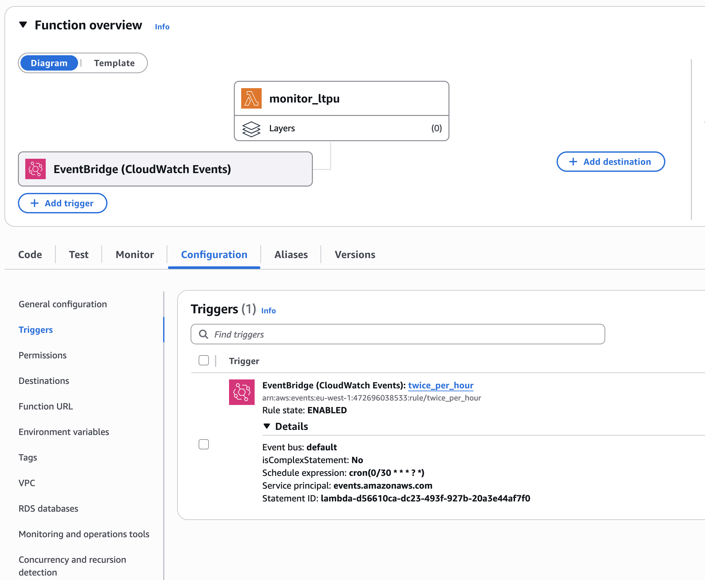
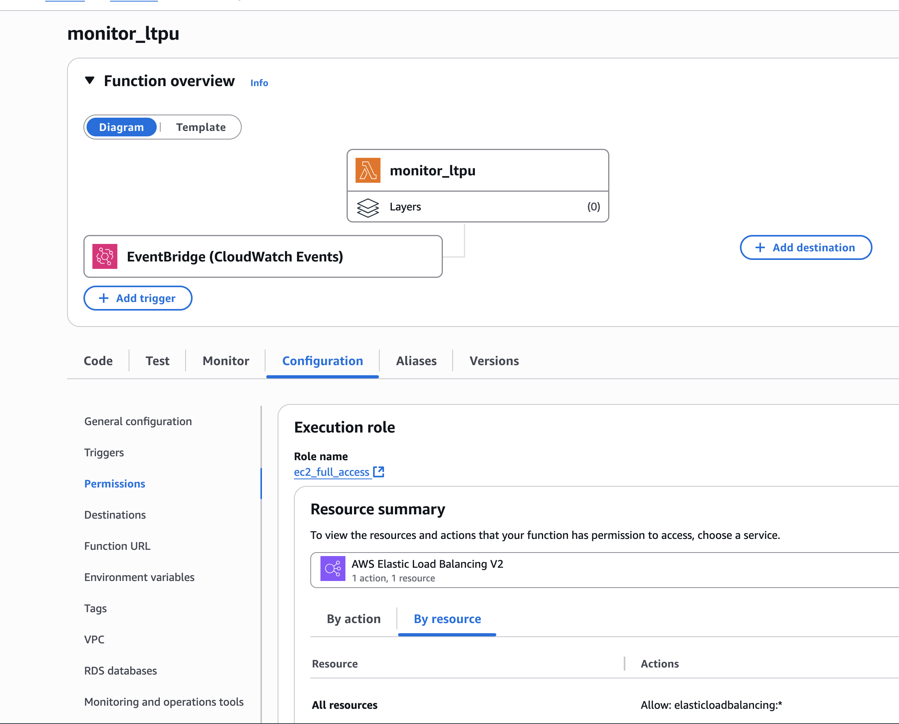
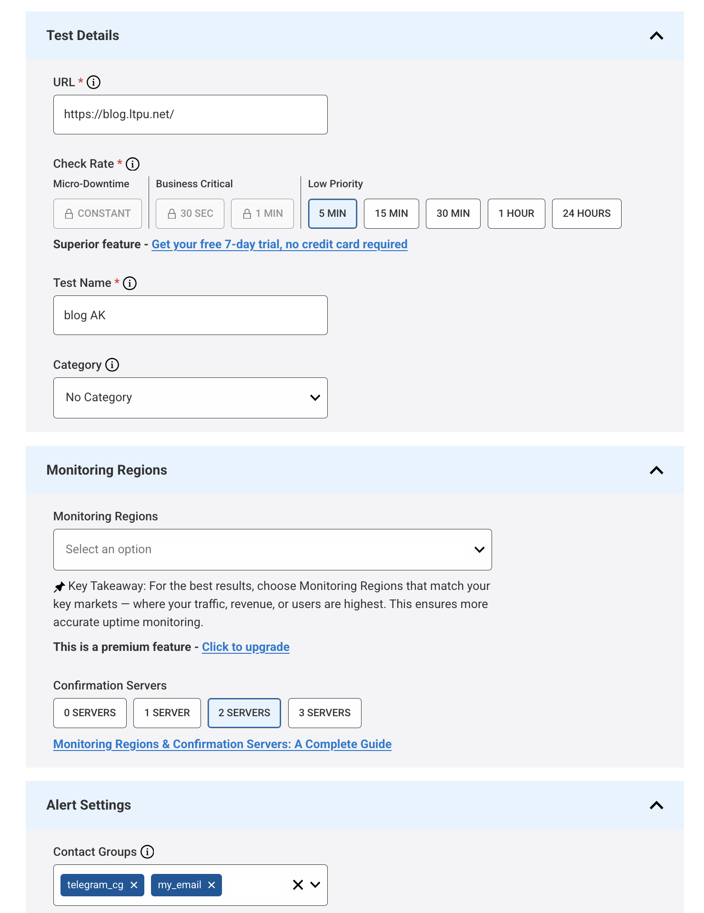

include::common/header.adoc[]

== Zero-Cost Website Recovery on AWS with Lambda
image:../static/image/calendar.png[cal,20] [.greyed]#16 Jul 2025#

=== Goal
If you have a website deployed on an AWS EC2 instance, it's important to ensure it's resilient - even on a minimal budget.
In this guide, we’ll implement a zero-cost solution using an link:https://aws.amazon.com/lambda/[AWS Lambda Function] that monitors your app
and automatically restarts the EC2 instance if the application becomes unresponsive.


=== Creating an AWS Lambda Function
We’ll create a Lambda function that:

1. Periodically calls your app's health check endpoint.
2. Triggers an EC2 reboot if the app is down.

Here’s a sample function written in Python:
```
import boto3
import urllib3

region = '<your_ec2_region>'
instances = ['<your_ec2_instance_id>']
ec2 = boto3.client('ec2', region_name=region)

def lambda_handler(event, context):
    http = urllib3.PoolManager()
    status_ltpu = http.request('GET',"<your_health_endpoint>", retries=False).status
    if status_ltpu != 200:
        reboot()
        return
    print('app is up and running...')

def reboot():
    ec2.reboot_instances(InstanceIds=instances)
    print('restarted instances: ' + str(instances))
```

==== Triggering the Lambda Function
To make the Lambda run on a schedule:

1. Attach an EventBridge trigger to the function.
2. Create a new rule with this schedule expression:
```
cron(0/30 * * * ? *)
```
This means it will run every 30 minutes.

AWS Lambda includes 1 million free requests per month and 400,000 GB-seconds of compute time.
Since this function runs only twice an hour, you're well within the free tier —
so there’s no cost for running this health check continuously.

[.center.text-center]


==== IAM Permissions
To allow the Lambda function to reboot your EC2 instance:

- Create a new IAM role.
- Attach the following least-privilege policy:
```
{
  "Version": "2012-10-17",
  "Statement": [
    {
      "Effect": "Allow",
      "Action": "ec2:RebootInstances",
      "Resource": "*"
    }
  ]
}
```
- Assign this role to your Lambda function.

[.center.text-center]


=== Configuring EC2 to Start the App After Reboots
After a reboot, your EC2 instance needs to automatically start the application.
On Amazon Linux (AMI), you can achieve this with `crontab`.

- Create a restart script:

`/home/ec2-user/blog/restart_blog.sh`
```
#!/bin/bash

# Kill existing process
kill -9 $(ps -aux | grep -w 'com.example.blog.BlogApplication' | grep -v grep | awk '{print $2}')

# Start application
nohup java -cp /home/ec2-user/blog/JAR com.example.blog.BlogApplication >> /home/ec2-user/blog/logs.log &

```

- Configure crontab.
```
crontab -e
```
Add the following line:
```
@reboot /home/ec2-user/blog/restart_blog.sh
```

This ensures your app starts automatically when the instance (re)starts.


=== Configuring Application Monitoring
To stay informed about website outages, we’ll use link:https://www.statuscake.com/[StatusCake],
which offers a free uptime monitoring plan that checks every 5 minutes.

1. Create a new uptime check in StatusCake.
2. Set the desired check interval (e.g., 5 minutes).
3. Configure your preferred notification channels:
- Telegram
- Email
- Slack, etc.

[.center.text-center]



=== Summary
With minimal effort and no additional cost, we’ve:

- Made our EC2-hosted application auto-recoverable using AWS Lambda.
- Ensured the app starts on reboot via a simple shell script and crontab.
- Configured monitoring and alerts using StatusCake.

This approach is suitable for non-critical applications or personal projects where brief downtime is acceptable.
Similar strategies can be applied in other cloud environments with minor tweaks.