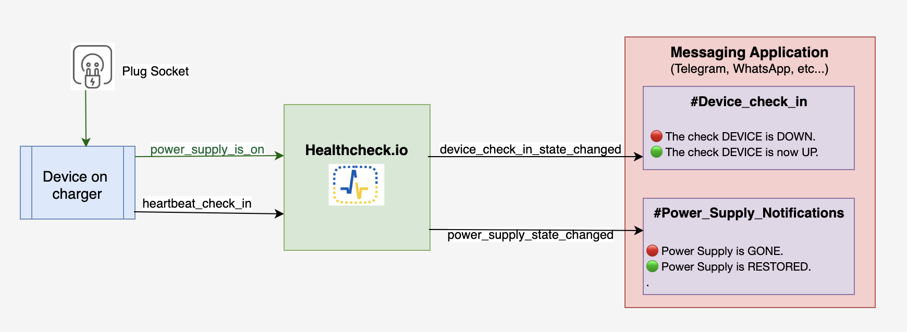
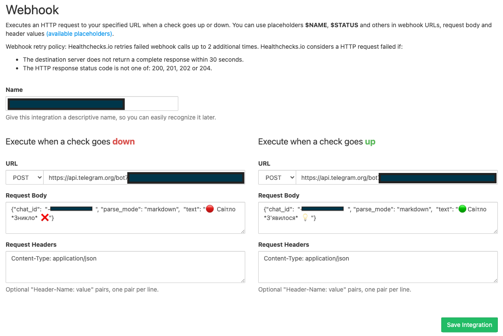
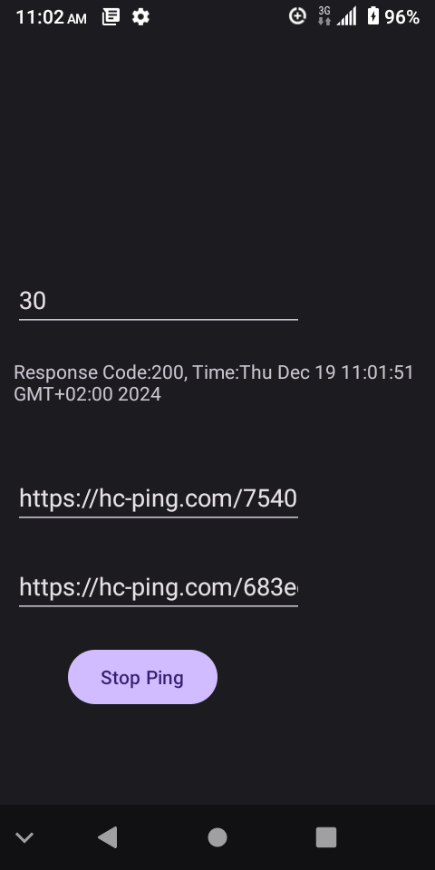
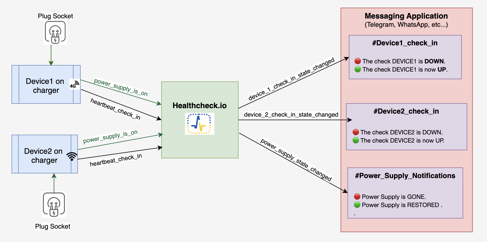

include::common/header.adoc[]

== Implementing Power Supply Status Notifications
image:../static/image/calendar.png[cal,20] [.greyed]#19 Dec 2024#

Given the regular power supply disconnects in your home, it might be beneficial to track corresponding power gone and restored events.
This helps you know how long your refrigerator was off (especially at night or when you’re away).
If the power supply is restored, you can consider returning home using the elevator, switching on washing and dishwashing machines, starting cooking, etc.


=== Solution Overview

We’ll implement the solution using link:https://healthchecks.io/[Healthchecks.io], an online service for monitoring regularly running tasks.
It uses the Dead Man’s Switch technique: the monitored system must "check in" with Healthchecks.io at regular, configurable intervals.
If Healthchecks.io detects a missed check-in, it sends out alerts.

**Goal:** Send notifications to messaging apps like Telegram or WhatsApp when the power supply is gone or restored.

=== Solution Diagram
[.center.text-center]


We need a device on a constant charger running an application that listens for POWER_CONNECTED and POWER_DISCONNECTED events.

- When power is connected, the app sends requests to Healthchecks.io at regular intervals (e.g., twice a minute).
- When power is disconnected, the app stops sending requests. If there are no requests within a configured time, Healthchecks.io sends an alert like: 🔴 Power Supply is GONE.
- When power is restored, the app resumes sending requests, and Healthchecks.io sends a notification: 🟢 Power Supply is RESTORED.

=== Configuring Healthchecks.io
1. Get familiar with the link:https://healthchecks.io/docs/[guidelines] and create a project with two checks:

- **Power Supply Check**: Listens for power supply requests.
- **Device Heartbeat Check**: Ensures the device is alive and reports correctly regardless of power supply status.

2. Each check generates a unique ping endpoint. The app must make HTTP GET requests to these endpoints to maintain an "UP" status.

=== Custom Notification Messages
Healthchecks.io uses predefined messages for direct application integrations, which cannot be customized. Example messages include:
```
🔴 The check phone_checkin is DOWN (success signal did not arrive on time, grace time passed).

🟢 The check phone_checkin is now UP.
```
To make notifications clearer regarding power outages,
we implemented a link:https://blog.healthchecks.io/2024/10/how-healthchecks-io-sends-webhook-notifications/[webhook] integration
using the link:https://core.telegram.org/bots/api[Telegram Bot API].
We created a bot and a Telegram channel, granting the bot admin rights for message delivery.
The API request format for sending messages is:
```
URL: https://api.telegram.org/bot<bot_token>/sendMessage
HTTP method: POST
Body: {"chat_id":  "<channel_id>", "parse_mode": "markdown",  "text": "🔴  Power Supply is *GONE*  ❌"}
Header: "Content-Type: application/json"
```
The `bot_token` is a credential generated by the bot setup. After configuring the webhook integration,
we enabled it for the power supply check.
[.center.text-center]



=== Creating the Application
We built a simple Android app that sends requests to the power supply and heartbeat endpoints at a specified interval.
The source code is available on link:https://github.com/anton-kolhun/android-experiment/blob/main/app/src/main/java/com/edu/beenergy/MainActivity.java[GitHub].

- Clone the repository and update the config with the generated above endpoints (link:https://github.com/anton-kolhun/android-experiment/blob/main/app/src/main/res/layout/activity_main.xml#L30[power_supply],
link:https://github.com/anton-kolhun/android-experiment/blob/main/app/src/main/res/layout/activity_main.xml#L20[heartbeat] ).
That should look like: https://hc-ping.com/<check_id>

- Build the app using:
```
./gradlew build :app:assembleDebug -x lintDebug

```
- Upload the APK (`./app/build/outputs/apk/debug/app-debug.apk`) to your Android device.
- Install and launch the app, set the desired ping interval, and click Start Ping.
- Put the device on a charger.

[.center.text-center]



=== Why Not Send Notifications Directly To Messaging Apps?
Direct notifications might seem easier, but consider these challenges:

- **App Crash:** If your app crashes, you won’t know until the next power event. Heartbeat check-ins address this issue.

- **Quick Power Fluctuations:** If power goes out and comes back instantly, you may want to avoid false notifications.
A scheduler with persistent storage would be needed, complicating the solution.

- **High Availability (HA):** Scaling to multiple devices requires a service to aggregate their statuses and send alerts accordingly.

=== Scaling the solution
You can easily add more devices. In my case:

- **Device 1:** Uses cellular data (4G).
- **Device 2:** Uses Wi-Fi (the router works during power outages).

Both devices share the same power supply check endpoint but have separate heartbeat endpoints.
An outage alert is triggered only if both devices report a failure.
Notifications are sent to a Telegram channel, enabling neighbors in the apartment building to stay informed.

[.center.text-center]


=== Summary

This guide explains how to set up a power supply status notification system using Healthchecks.io and an Android app.
The system monitors power supply events and sends alerts through messaging apps.
By combining device heartbeat monitoring and power event detection, the solution ensures reliability, scalability, and resilience.