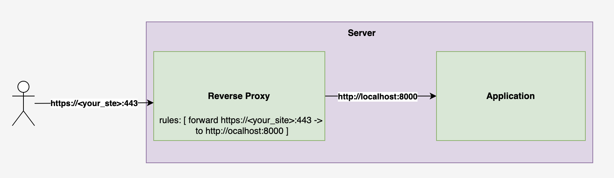
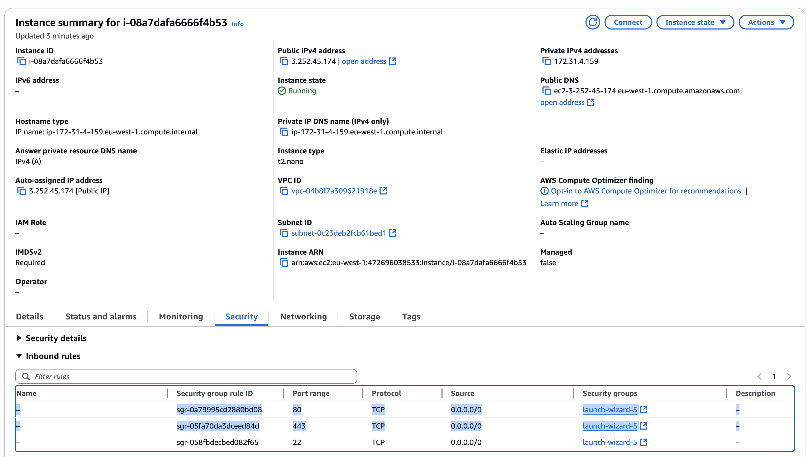
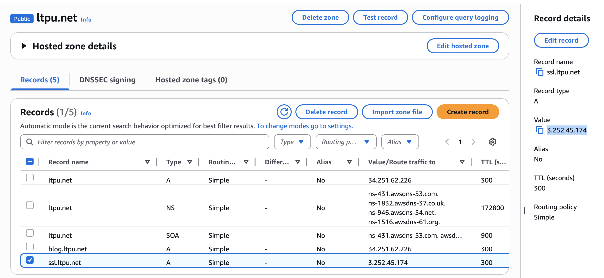

include::common/header.adoc[]

== Enrolling and Provisioning an SSL Certificate With Let’s Encrypt
image:../static/image/calendar.png[cal,20] [.greyed]#23 Jul 2025#

=== Goal
This guide will walk you through securing a web application with an SSL certificate issued by *Let’s Encrypt*,
using *Apache HTTP Server* as a reverse proxy.
[NOTE]
====
While this guide uses AWS EC2 as the example, the same steps apply to any Linux-based server,
whether hosted on a different cloud provider or on a self-managed machine.
====

=== Prerequisites
- You have an *Amazon Linux (AMI)* EC2 instance running your web application.
- The application exposes HTTP traffic on a specific port (e.g., `8000`)

=== Solution Overview
The most common way to secure your application with an SSL certificate is to introduce a *reverse proxy* in front of it.
The reverse proxy exposes a *HTTPS* endpoint and forwards incoming traffic to your application’s *HTTP* port.
[.center.text-center]


=== Step 1: Configure EC2 Security Group
Update the inbound rules of your EC2 instance’s security group to allow:

- TCP port *80* (HTTP)
- TCP port *443* (HTTPS)
[.center.text-center]


=== Step 2: Register a DNS Record
Use your domain registrar (e.g., *AWS Route 53*) to create a DNS record pointing to your EC2 instance.
Example:
```
ssl.ltpu.net -> 3.252.45.174
```
[.center.text-center]


=== Step 3: Install and Configure Apache HTTP Server
We’ll use link:https://letsencrypt.org/getting-started//[Apache Http Server] (httpd) as a reverse proxy. +
SSH into your EC2 instance and run the following commands:
```
sudo yum install httpd -y
sudo systemctl enable httpd
sudo systemctl start httpd
```
Verify it's working:
```
curl localhost:80

```
Expected output:
```
<html><body><h1>It works!</h1></body></html>
```

Now configure Apache to forward traffic from port 80 to your application (running on `localhost:8000`).
Edit the Apache config:
```
sudo vi /etc/httpd/conf/httpd.conf
```
Add the following block after `Listen 80`:
```
<VirtualHost *:80>
    DocumentRoot "/var/www/html"
    ServerAlias "forward"
    ProxyPass / http://localhost:8000/
    ProxyPassReverse / http://localhost:8000/
    RewriteEngine on
</VirtualHost>
```
Restart Apache:
```
sudo systemctl restart httpd
```
Verify that the proxy is working:
```
curl localhost:80
```
This should now return the output from your application running on port 8000.


=== Step 4: Enroll and Provision SSL Certificate
link:https://letsencrypt.org/getting-started/[Let's Encrypt] is a free certificate authority provider. +
We’ll use link:https://certbot.eff.org/[Certbot] to request an SSL certificate from Let’s Encrypt. +
Install Certbot and its Apache plugin:
```
sudo yum install certbot -y
sudo yum install certbot-apache -y

```
Run Certbot:
```
sudo certbot
```
Provide the requested info: email, domain name (`ssl.ltpu.net`), etc.
If successful, you’ll see a message like:
```
Deploying certificate
Successfully deployed certificate for ssl.ltpu.net to /etc/httpd/conf/httpd-le-ssl.conf
Congratulations! You have successfully enabled HTTPS on https://ssl.ltpu.net
```
Visit your https endpoint (https://ssl.ltpu.net) to verify the setup.


=== Step 5: Configure Auto-Renewal
Let’s Encrypt certificates are valid for 90 days. To automatically renew them, install `cronie`:
```
sudo yum install cronie -y
```

Edit the crontab:
```
crontab -e
```

Add the following line to renew the certificate every 10 days:
```
0 0 */10 * * sudo certbot renew
```

Certbot will email you if the certificate is about to expire or is renewed.

=== Summary
In this guide, we’ve:

- Installed and configured Apache as a reverse proxy
- Enrolled an SSL certificate from Let’s Encrypt
- Enabled HTTPS on an EC2-hosted web app
- Set up automatic certificate renewal

Your application is now securely accessible over *HTTPS*.


